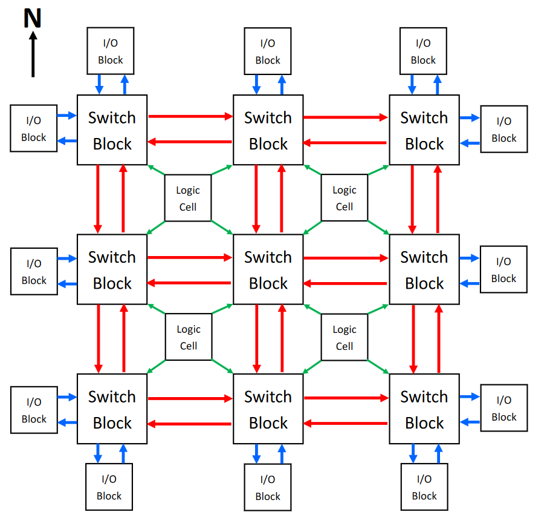
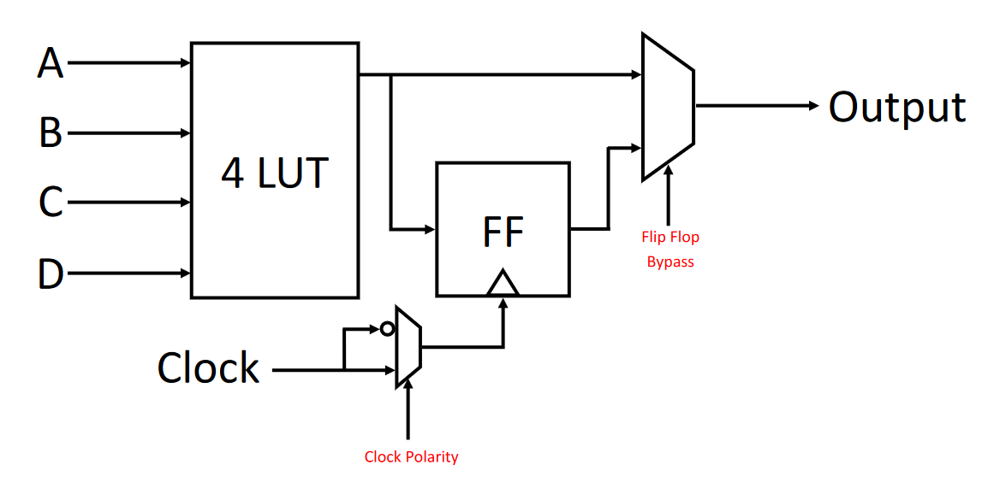
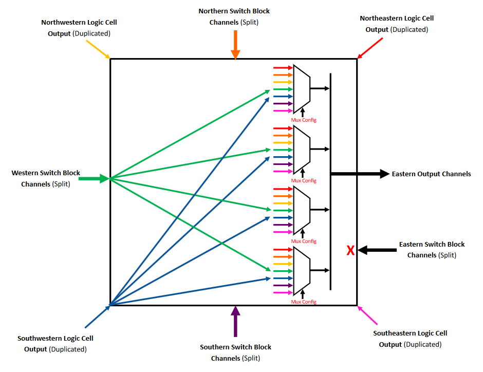
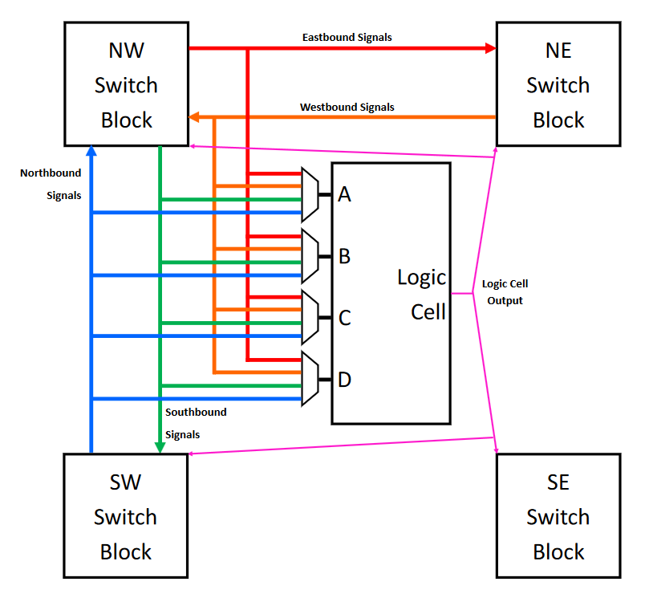

# myfpga

A work-in-progress FPGA architecture

The FPGA will be implemented in SystemVerilog and simulated using a Verilator
model linked against a C++ launcher.

Designs meant to run on myfpga within the simulation are written in Verilog-2005
and may be simulated themselves using Verilator or using the simulator
built into the myfpga toolchain.
The toolchain will perform place-and-route and generate a bitstream,
which the myfpga simulation C++ launcher will load into the simulated FPGA.

## Architecture

The elements of the myfpga architecture are laid out in a grid.
The direction towards the top of the device is called "north",
the direction towards the bottom "south".
Similarly the directions towards the left and right
are called "west" and "east" respectively.



### Logic Cells

Logic cells implement any arbitrary logic function using a 4-input lookup table (LUT).
Wider logic functions are implemented by cascading logic cells.
The output is optionally buffered through a flip flop (FF) with
configurable clock polarity (rising or falling edge triggered).



Currently all flip flops in the design must reside in the same clock domain.
The source of this clock signal must come from a single I/O block attached
to the global clock tree.

### I/O Blocks

I/O blocks receive signals from outside the device for transmission to logic cell inputs,
or send them outside of the device via a connected logic cell output.

### Switch Blocks

Switch blocks receive data from the adjacent switch blocks to the north, south,
west, and east (or from an adjacent I/O block if at the edge of the device).
These are composed of four channels each, each carrying a separately routed signal.
Additionally, switch blocks receive a signal from the output of the logic
cells at each corner.

#### Internal Routing



Switch blocks output data on all four channels on each side by choosing
one of the inputs to route to each channel.
Any input from any channel of any side or corner can be routed to any output.
The only restriction is that inputs from a given side cannot be routed
to outputs on the same side, but this would never be useful anyway.

Each side of the switch block uses four multiplexers, one for each channel.
The inputs of the multiplexer are the signals from each of the four corners,
as well as the corresponding signal for that channel from each of the four sides.

#### Logic Cell Inputs



The channels between switch blocks are tapped by adjacent logic cells.
A given logic cell can use the following signals as any of its four inputs:

* Northbound signals output by its southwest switch block
* Westbound signals output by its northeast switch block
* Southbound or eastbound signals output by its northwest switch block

Note that all channels of the above data are routable to any input,
but have been omitted from the diagram for simplicity.
In reality the four-input multiplexers pictured are 16-input multiplexers.

Also note that the southeast switch block cannot be used for input routing at all,
but does still receive the logic cell's output signal (as do the other three
adjacent switch blocks).

## Toolchain

The steps to implement a design on myfpga follow these steps:

1. Synthesize Verilog-2005 into a JSON lookup table (LUT) and flip flop (FF) JSON netlist using Yosys.
2. Import JSON netlist into the main toolchain and convert into a directed graph of LUTs and FFs.
3. Convert discrete LUTs and FFs into combined logic cells where possible,
   creating passthrough LUTs and bypassing FFs where they cannot be combined
   into a single logic cell. This process of converting discrete synthesis
   elements into architectural elements is called the "implementation" step.
4. Place and route the logic cells using a simulated annealing algorithm
   to find an optimal arrangement.
5. Generate a bitstream which can be used to configure the device.

A prototype Python toolchain has been completed, except for the bitstream generation.
I am currently in the process of porting it to Rust for performance reasons.

The bitstream format relies on the order of various shift registers within the
device which will hold the configuration, and so I am waiting to implement that
part of the toolchain until the device's configuration system is finished.

## Simulation

Any design should be run using a "real" simulator like Verilator
before running through the toolchain in order to verify its behavior.

That said, there post-implementation simulation is provided as part of the toolchain.
The implementation graph is broken at flip flop outputs to create a directed acyclic graph,
which can be topologically sorted to determine an evaluation order in which to emulate the logic cell behavior.

## Operation

Once the FPGA design is working, the bitstream can be loaded in order to
run the design "for real".

## Development

The main toolchain is implemented in Rust and can be
[installed via rustup](https://www.rust-lang.org/learn/get-started).
Some supplementary tools are also required to build the simulator
and to do target design synthesis.

```
apt install build-essential cmake ninja-build verilator yosys
```
